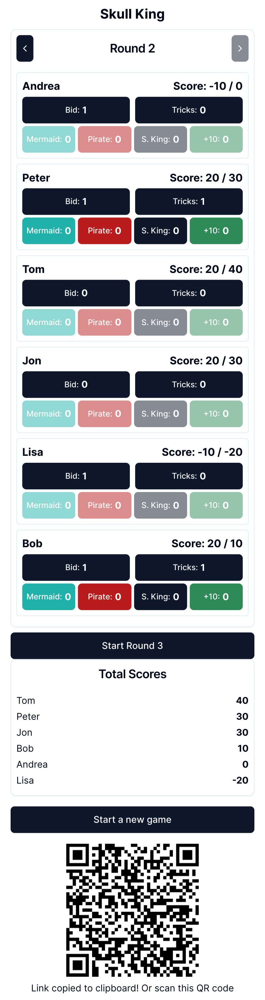

<h1 align="center">
  
</h1>

# Skull King Score Calculator

A Progressive Web App (PWA) for calculating scores in the Skull King card game.

## Features

- **Score Calculation**: Easily track and calculate scores for 2-8 players in the Skull King game.
- **Round Management**: Navigate through up to 10 rounds of gameplay.
- **Special Card Tracking**: Keep count of special cards (Mermaids, Pirates, Skull King, +10 cards) for accurate scoring.
- **Progressive Web App**: 
  - Works offline once installed
  - Installable on both desktop and mobile devices
  - Compatible with Android and iOS
  - Responsive design for various screen sizes
- **Real-time Score Updates**: Scores are calculated and updated in real-time as you input bids, tricks, and special cards.
- **No use of Web Cookies**
- **Entirely free and ads-free (open-source)**

## How It Works

1. **Setup**: Enter player names (2-8 players) before starting the game.
2. **Round Play**: For each round, input the bids and tricks for each player.
3. **Special Cards**: If a player wins their bid, you can add any special cards they captured.
4. **Scoring**: The app automatically calculates scores based on Skull King rules.
5. **Navigation**: Easily move between rounds to review or update scores.
6. **Game End**: View final scores ranked from highest to lowest.

## Installation

To install the app on your device:

1. Visit [https://frisoft.it/skull-king](https://frisoft.it/skull-king) in your web browser.
2. For iOS: Tap the share button and select "Add to Home Screen".
3. For Android: Tap the menu button and select "Add to Home Screen" or "Install App".
4. For desktop: Look for the install icon in your browser's address bar.

## Offline Use

Once installed, the app can be used without an internet connection. Your game data is stored locally on your device.

## Development

This project is built using React and Vite, with TypeScript for type safety. It uses Tailwind CSS for styling and shadcn/ui for UI components.

To set up the development environment:

1. Clone the repository
2. Run direnv allow (you need Nix and direnv installed if intatlling the dependencies via Nix)
3. Run `pnpm install` to install dependencies
4. Use `pnpm dev` to start the development server

## Contributing

Contributions are welcome! Please feel free to submit a Pull Request.

## License

This project is open source and available under the [MIT License](LICENSE).
